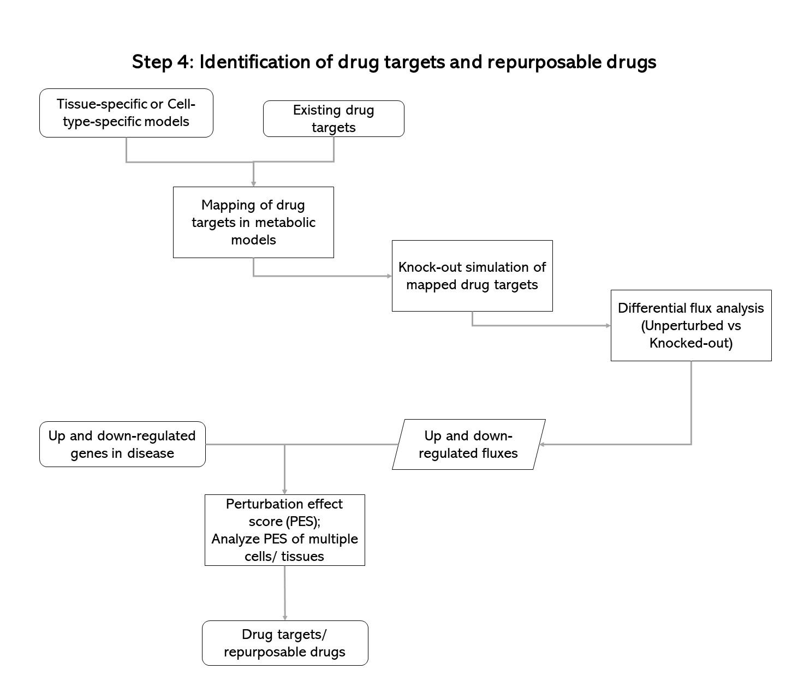

# pipelines

This is the home page for pipeline project.

## FlowCharts




## Run Script
1. Download Data from https://www.ncbi.nlm.nih.gov/geo/query/acc.cgi?acc=GSE2770
2. Run Affy_Script.r in the same folder of the extracted data files

Raw data
RMAC Data

## Todolist
* Build a Python RESTful prototype
* Implement Step 2 (when Bhanwar back)
* ~Implement step 1 (read raw data) via Python, automate the manual operations~
* ~1. Setup development environment for R and Python~


## Resources
* https://opencobra.github.io/
* cobrapy [doc](https://cobrapy.readthedocs.io/en/stable/), [installation](https://github.com/opencobra/cobrapy/blob/master/INSTALL.rst)
* Limma R package [User Guide](https://www.bioconductor.org/packages/release/bioc/vignettes/limma/inst/doc/usersguide.pdf), [installation](https://bioconductor.org/packages/release/bioc/html/limma.html)
* [affy—analysis of Affymetrix GeneChip data at the probe level](./papers/btg405.pdf)
* [R project](https://www.r-project.org/), [Installation of R, R Studio, R Commander](https://www.andrewheiss.com/blog/2012/04/17/install-r-rstudio-r-commander-windows-osx/)
* [rpy2](https://rpy2.readthedocs.io)
* [biopython](https://biopython.org/wiki/Packages)
* Python: [GEOparse](https://geoparse.readthedocs.io/) [PDF](./doc/geoparse.pdf), R: [GEOquery](https://bioconductor.org/packages/release/bioc/html/GEOquery.html)
* [R Tutorial](https://www.cyclismo.org/tutorial/R/index.html)
* Python RESTful [Tutorial 1](https://kite.com/blog/python/flask-sqlalchemy-tutorial/), [Tutorial 2: API](https://kite.com/blog/python/flask-restful-api-tutorial/), [Tutorial Index](https://realpython.com/tutorials/api/), [Book: RESTful Web Services](http://restfulwebapis.org/RESTful_Web_Services/)
* Docker: [Common components](https://www.digitalocean.com/community/tutorials/the-docker-ecosystem-an-introduction-to-common-components), [Containerization](https://www.digitalocean.com/community/tutorials/the-docker-ecosystem-an-overview-of-containerization)
* Google Cloud Platform, Bigquery [Public Datasets](https://www.reddit.com/r/bigquery/wiki/datasets)
* Biomart: ENTREZ ID search, [mygene](https://mygene.info/)


## Repository Structure

```bash
├── README.md # README
├── code # R & Matlab code
│   ├── Affy_Script.r
│   ├── Duplicated_cmapFiles_Sript.R
│   ├── GEO_ID_maps.r
│   ├── Knock_out_simulation_1.m
│   ├── SCORE.R
│   ├── SCORE_DOWN.R
│   ├── SCRIPT_ExtractingFRatio_DE_genes_2.R
│   ├── Script_CMap_FCMat_data.R
│   ├── Script_DT.R
│   ├── Script_EntrezWise_DrugsConMap.R
│   ├── Script_Replicating_multiEntrezIDs.r
│   ├── Script_merging_data.txt
│   ├── Validation_withCMap_STAT.R
│   └── merge_R.R
├── data # Gene Data
│   ├── GSE2770_RAW # Folder of RAW data of GSE2770
│   ├── gpl570entrez.csv
│   ├── gpl8300entrez.csv
│   ├── gpl96entrez.csv
│   └── gpl97entrez.csv
├── doc # documents
│   ├── IMG_1.jpg
│   ├── IMG_2.jpg
│   ├── IMG_3.jpg
│   └── IMG_4.jpg
├── output # Outputs & Intermediate Files
│   └── GSE2770
├── papers # papers
│   ├── Methods.pdf
│   ├── btg405.pdf
│   └── usersguide.pdf
└── py # Python code
    ├── Scratch_Pad.ipynb
    ├── Sort_CEL_Files.ipynb
    ├── download_gsm_id_maps.py
    └── step1_read_raw_data.py
```
